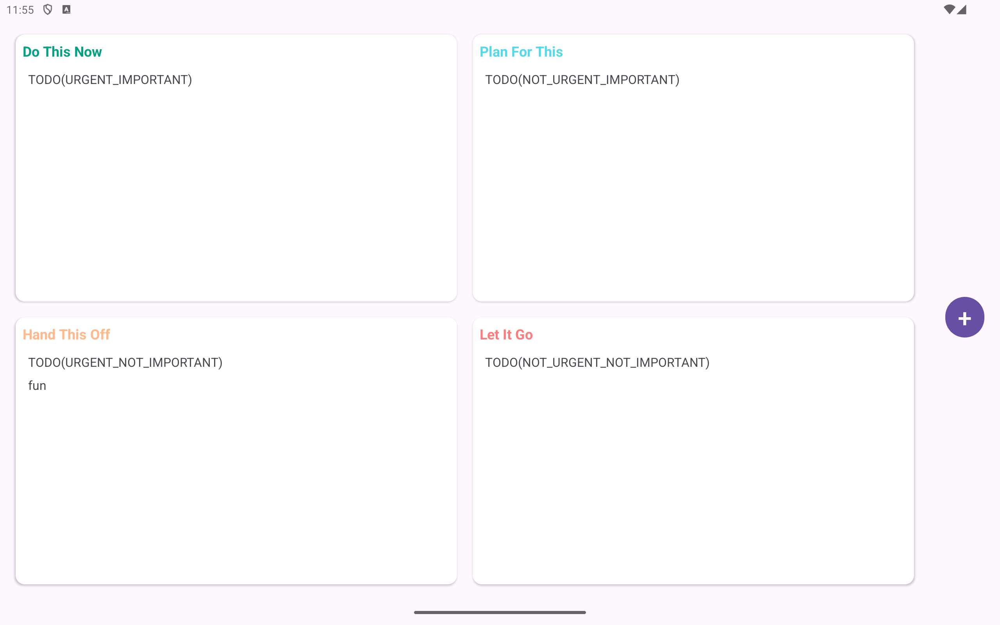
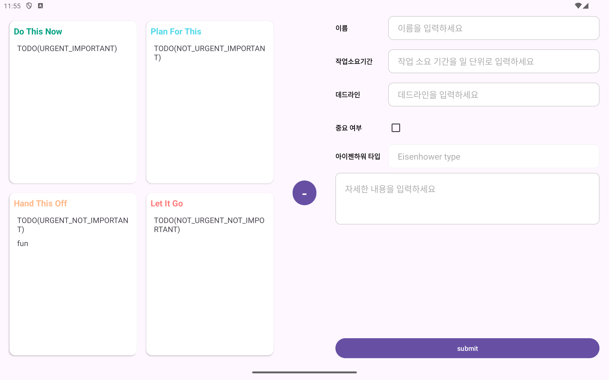

# 학습
- Koin 체험
- ViewModel 체험
- LiveData 체험
- Fragment 체험

# 프로젝트 내용
- 아이젠하워 매트릭스를 이용한 간단한 TODO List
- 해보고싶은것
  - TODO 추가/삭제/수정
  - 사용자의 TODO 입력 정보를 아이젠하워 매트릭스로 분류해서 보여주기
  - TODO를 Local DB에 저장(Maybe use Room)
  - Livedata 사용 감 잡기
  - 어색한 XML을 이용한 화면 구성과 친해지기

# 이미지

